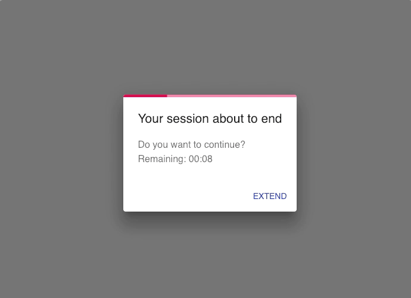

<h2 align="center">
  mui-timeout :bomb:
</h2>
<h3 align="center">
  A timeout dialog React component built with Material UI.
</h3>
<h3 align="center">
  
</h3>

---

### Install
```bash
$ npm i -S mui-timeout
# or with yarn
$ yarn add mui-timeout
```

### Usage

```js
import TimeoutDialog from 'mui-timeout'

<TimeoutDialog interval={3} end={new Date(2019, 1, 6, 10, 0)} />
```

### API
**Props**  
`end` `{Date} *`  
End time.  

`onActionClick` `{function(ended: Boolean)} *`   
Action button click listener.  

`interval` `{String}`  
Timeout interval, time to inform before end (in minutes).  

`title` `{Object}`  
`title.inform` `{String}`  
Inform title.  
`title.ended` `{String}`  
Title to show when timeout ends.  

`content` `{Object}`  
`content.inform` `{String}`  
Inform content.  
`content.ended` `{String}`  
Content to show when timeout ends.  

`actionButtonText` `{Object}`  
`actionButtonText.inform` `{String}`  
Text to show on action button.  

`actionButtonText.ended` `{String}`  
Text to show on action button when timeout ends.  

`color` `{String}`  
One of "primary" or "secondary".  

### Author
Ismail Demirbilek [@dbtek](https://twitter.com/dbtek)
